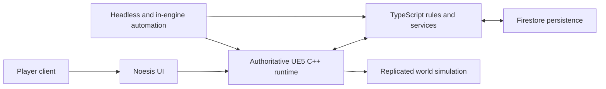

_CityRPG_ is a standalone, server-authoritative multiplayer RPG built in Unreal Engine 5. It combines a native C++ runtime, a Puerts/Node-backed TypeScript gameplay layer, Noesis UI, Firestore persistence, dedicated-server targets, and a large automation surface.

The project began with a simple question: what would CityRPG become if it no longer had to live inside someone else's sandbox? The answer was not a direct port. The standalone version needed its own authority model, world simulation, networking, user interface, deployment path, and production tooling.

## The architecture

The game is divided around clear ownership boundaries:

- **Native C++** owns latency-sensitive and world-authoritative behavior: players, combat, ships, building placement, replicated state, harvesting, and runtime actors.
- **TypeScript** owns rules that benefit from rapid iteration: quests, dialogue, civic systems, property taxation, commerce, buildable scripts, and persistence workflows.
- **Firestore** stores durable player and world state through server-controlled paths.
- **Noesis** presents game state and sends player intent without becoming the source of truth.
- **Automation tooling** exercises the same boundaries through C++, TypeScript, Python, PowerShell, and standalone UI tests.

## Systems built in the standalone version

The February through May 2026 development window established several major slices:

- A dedicated-server gameplay foundation with persistent players and scriptable world objects.
- A standalone Noesis preview application for UI work without launching Unreal Editor.
- Quest onboarding, combat feedback, crime, guard escalation, capture, jail, and civic services.
- Moving ships with server-owned helm state, deck walking, buoyancy, replication smoothing, and voyage UI.
- Deterministic, headless naval combat connected to a live tactical presentation layer.
- Seeded procedural islands with reproducibility proofs, validation reports, navigation, collision, and performance audits.
- A compatibility-preserving decomposition of a 43,758-line UI implementation into focused controllers.
- Server-authoritative prefab placement with client-side ghost previews and plot-boundary validation.

## Engineering philosophy

The common thread is not any one gameplay feature. It is the decision to make complex behavior observable and testable before treating it as complete.

Ship movement was measured in ship-local space. Tactical combat was deterministic before it had cannon effects. Procedural islands emitted hashes and machine-readable validation reports. External SDK integrations failed closed. UI refactors preserved contracts through automation instead of relying on manual clicking.

That approach makes CityRPG useful as more than a game prototype. It is a demonstration of how I design stateful systems: establish authority, make transitions explicit, create seams for iteration, and build evidence into the delivery path.

## Engineering case studies

- [Rebuilding CityRPG as a standalone Unreal Engine multiplayer game]({{ '/posts/cityrpg-standalone-architecture/' | relative_url }})
- [Building a faster Noesis UI iteration loop]({{ '/posts/cityrpg-noesis-ui-preview-tool/' | relative_url }})
- [Scriptable world objects with server authority]({{ '/posts/cityrpg-scriptable-world-objects/' | relative_url }})
- [Crime, capture, and jail as a multiplayer state machine]({{ '/posts/cityrpg-crime-capture-jail-state-machine/' | relative_url }})
- [A repeatable Unreal performance pipeline]({{ '/posts/cityrpg-unreal-performance-pipeline/' | relative_url }})
- [Walking on a replicated moving ship]({{ '/posts/cityrpg-moving-ship-replication/' | relative_url }})
- [A voice architecture that fails closed]({{ '/posts/cityrpg-voice-fail-closed/' | relative_url }})
- [Why naval combat was built headless first]({{ '/posts/cityrpg-headless-naval-combat/' | relative_url }})
- [From combat receipts to live ocean hazards]({{ '/posts/cityrpg-ocean-hazard-presentation/' | relative_url }})
- [A deterministic procedural-island pipeline]({{ '/posts/cityrpg-procedural-island-pipeline/' | relative_url }})
- [Replacing a 43,758-line UI god object]({{ '/posts/cityrpg-ui-god-object-refactor/' | relative_url }})
- [Server-authoritative prefab placement]({{ '/posts/cityrpg-server-authoritative-prefab-placement/' | relative_url }})

## Technology

**Unreal Engine 5 · C++ · TypeScript · Puerts · Node.js · NoesisGUI · Firebase/Firestore · Python · PowerShell · WPF · Dedicated servers · Automation tests**
