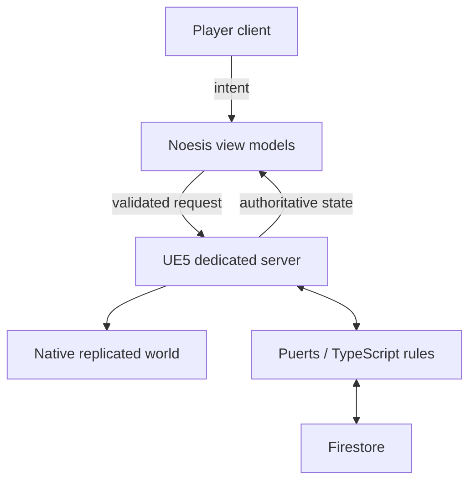

Rebuilding CityRPG as a standalone game was not a matter of copying features into a new client. The original idea depended on another game's world, lifecycle, and extension points. A standalone version had to own every important decision: player identity, persistence, combat, building, UI, networking, deployment, and failure recovery.

The first architectural goal was therefore not feature parity. It was establishing boundaries that could survive years of iteration.

## Start with authority

In a multiplayer RPG, duplicated authority becomes a source of exploits and impossible bugs. I divided the system according to the kind of truth each layer should own.

Native Unreal C++ owns the world. It creates actors, resolves combat, validates movement and placement, replicates state, and runs the dedicated server. TypeScript owns rules that change frequently, including quests, dialogue, commerce, civic policy, and buildable behavior. Firestore stores durable state, but only server-controlled paths can decide what is valid. Noesis renders state and submits intent; it never authors gameplay truth.

This split let me keep latency-sensitive behavior near the engine while retaining a fast development loop for content-heavy rules.

## A bridge, not two separate games

The difficult part was connecting those layers without creating two competing runtimes. The TypeScript subsystem exposes narrow operations rather than unrestricted engine access. Gameplay events are converted into explicit payloads; TypeScript evaluates rules; native code validates and applies results.

That pattern supports systems such as:

- A quest rule reacting to a server-confirmed world event.
- A buildable script requesting a sound, effect, inventory change, or UI event.
- A civic service reading persistent state and returning an election or tax result.
- A dialogue branch advancing only after server-owned conditions pass.

Every bridge operation has a test seam. The C++ fixture can capture UI events, combat events, audio, effects, inventory, currency, player roles, and persistence payloads without requiring a full public server session.

## Dedicated-server reality

Editor success is not proof of multiplayer correctness. The project includes a dedicated-server target and treats packaged execution as a separate environment. Systems that accidentally depend on editor state, local assets, or client-only objects need to fail during automation rather than after deployment.

This influenced everything from cook manifests to authentication and world restoration. It also encouraged machine-readable logs and stable IDs, because a dedicated server cannot rely on a developer watching the viewport.

## What this foundation enabled

Once the authority model was stable, features could grow independently without erasing their boundaries. The same architecture later supported server-owned ship movement, TypeScript voyage rules, Noesis tactical UI, Firestore-backed civic systems, and procedural-world validation.

The lesson was straightforward: a standalone rewrite earns its freedom only when it accepts responsibility for the whole operating model. Owning the executable is useful; owning the boundaries is what makes it a platform.
