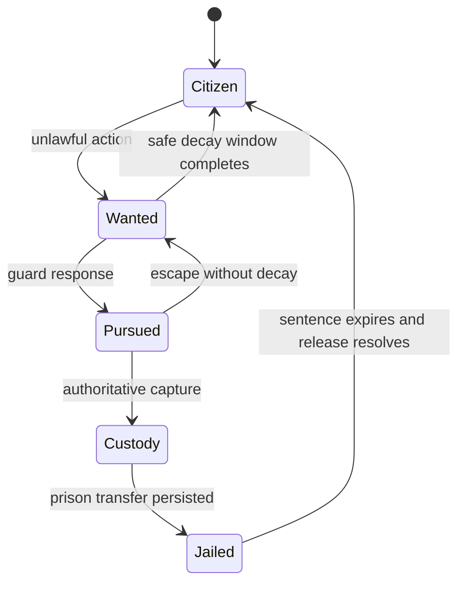

A crime system becomes interesting only when its consequences form a complete loop. Marking a player as wanted is easy. Making pursuit, capture, custody, release, persistence, and law-role behavior agree under multiplayer conditions is the real system.

CityRPG models that loop as explicit server-owned transitions rather than a collection of UI flags.

## The state transition is the feature

An unlawful action adds demerits and can move a player into a wanted state. Attacking an active guard escalates pressure faster. Recent combat suppresses passive decay so a criminal cannot clear their status while the fight is still active.

Law players can inspect wanted targets and attempt capture. A successful capture transfers the target into custody, writes the persistent jail state, and starts a real-time sentence. Release remains deterministic even if the player disconnects during custody.

The user interface reports those states, but it does not create them. Town Hall and law screens send requests and render server responses.

## Guard behavior needed its own rules

Giving one player group enforcement power creates obvious abuse risks. The implementation therefore treats law roles as responsibilities rather than unrestricted permissions.

Guard-target attacks increase criminal escalation. Guard misconduct can remove the current law title and require the player to re-enter progression through the civic system. Payouts and role checks are validated against server state rather than client claims.

This also made testing more valuable than a happy-path demo. The suite covers role membership, target status, repeated escalation, capture eligibility, jail timers, and recovery behavior.

## Persistence changes the design

Custody cannot be stored only on a pawn. Pawns disappear. Connections drop. Servers restart. The durable record needs enough information to reconstruct the correct state without replaying an unsafe action.

The persistent model records the custody state and timing while native runtime code owns the actual prison transfer and release behavior. That division makes offline sentence progression possible without allowing a client to decide that a sentence has ended.

## Packaged validation

The law loop crosses TypeScript rules, native combat events, Noesis UI, authentication, and Firestore. I added packaged authentication workflows and end-to-end fixtures so the system could be validated in the environment where identity and persistence actually matter.

The important result was not merely that players could be jailed. It was that every transition had an owner, a durable representation, and a recovery path. That is the difference between a gameplay effect and a multiplayer system.
