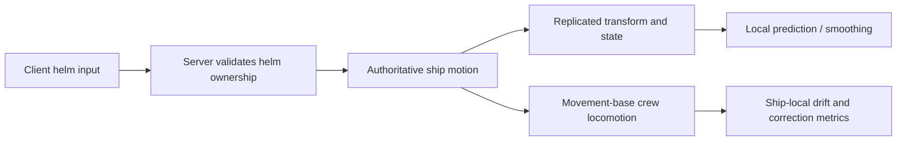

Buoyancy is the visible part of a ship system. Multiplayer deck locomotion is the part that decides whether the ship is actually playable.

A convincing hull can move through waves while every player standing on it jitters, drifts, snaps, or falls through remote clients. I built the CityRPG ship runtime from the moving-deck problem outward.

## One ship truth

The dedicated server owns the ship transform, helm holder, rudder input, propulsion state, and overboard transitions. Clients can predict presentation, but they do not create an alternate authoritative trajectory.

Crew use Unreal's movement-base behavior rather than being hard-attached to the ship. That preserves normal walking, sprinting, jumping, landing, and recovery while the base translates and rotates beneath them.

## Build the seam before the ocean

The first movement model was intentionally deterministic. A fixed-speed ship with rudder turning is easier to reason about than a full ocean simulation. Once crew locomotion and replication had a stable baseline, wave following and pontoon-style buoyancy could be introduced behind the same motion seam.

This prevented water technology from hiding basic networking defects. Cosmetic motion is not evidence that remote deck walking works.

## The bugs were relational

Several failures appeared only when multiple systems interacted:

- Client meshes walked correctly in world space but did not remain visually based on the ship.
- Idle foot IK reacted to the moving deck and produced unwanted presentation noise.
- Replication frequency and smoothing settings could improve the hull while making crew corrections more visible.
- Helm input needed explicit ownership and locking so two clients could not steer the same ship.
- Spawn surfaces and replication-graph initialization behaved differently on the ocean runtime map.

These were not isolated physics bugs. They were disagreements about which transform, owner, or lifecycle phase was authoritative.

## Measure in ship-local space

World-space movement alone cannot tell whether a player is stable relative to a moving deck. The test harness records ship-local drift, corrections, rebasing, remote-view stability, and overboard recovery. Clean and emulated network profiles can exercise the same scenario repeatedly.

That telemetry gave later changes a contract: wave following, buoyancy, prediction, and propulsion tuning were allowed to change the ship, but not silently regress the crew experience.

The result was a foundation for voyages and naval encounters built on multiplayer behavior rather than a single-player visual prototype.
