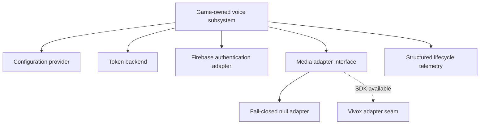

Third-party SDK work creates a dangerous temptation: make the happy path look complete before the real dependency is available.

The CityRPG workspace did not yet contain the Vivox Unreal SDK. Instead of stubbing the integration as "connected," I built the surrounding voice architecture so unavailable media failed closed and reported exactly why.

## Separate product state from SDK state

The runtime defines interfaces for backend requests, authentication, permissions, devices, media operations, configuration, and telemetry. The game-owned subsystem advances through explicit bootstrap and connection states while an adapter translates those operations to a provider.

That design keeps gameplay and UI code from depending directly on SDK objects. It also makes the absence of the SDK a supported state rather than an accidental crash path.

## Tokens belong on the server

The backend workspace defines contracts for configuration, claims, operational policy, and voice tokens. Clients request scoped login and join tokens through authenticated server paths; they do not generate privileged tokens locally.

Firebase emulator tests and HTTP contract tests cover token requests, configuration, rules, and error behavior without needing real media traffic. This lets security-sensitive work progress before an external SDK or non-production voice environment is available.

## Null does not mean silent failure

The null media adapter does not pretend to initialize. It produces machine-readable `VoiceUnavailable` and client-initialization failure events. The subsystem can still validate state-machine wiring, permission decisions, device snapshots, backend responses, and telemetry shape.

This is important operationally. "Voice does not work" is a poor incident. "The SDK dependency is absent, initialization failed closed, and no channel connection was attempted" is actionable.

## A clean enablement boundary

The real adapter was deliberately scoped: initialize the client, authenticate with backend-issued tokens, connect one positional channel, update 3D position, handle participant and speaking events, and support baseline transmission state. Radio, phone, dispatch, moderation workflows, and richer acoustic modes remained outside the first signoff.

I did not treat the scaffold as proof that real voice media had shipped. It was proof that adding the provider would be an integration task rather than an architectural rewrite.

That distinction is one of the most valuable habits in integration work: make incomplete dependencies explicit, test everything around them, and never turn a missing capability into false success.
