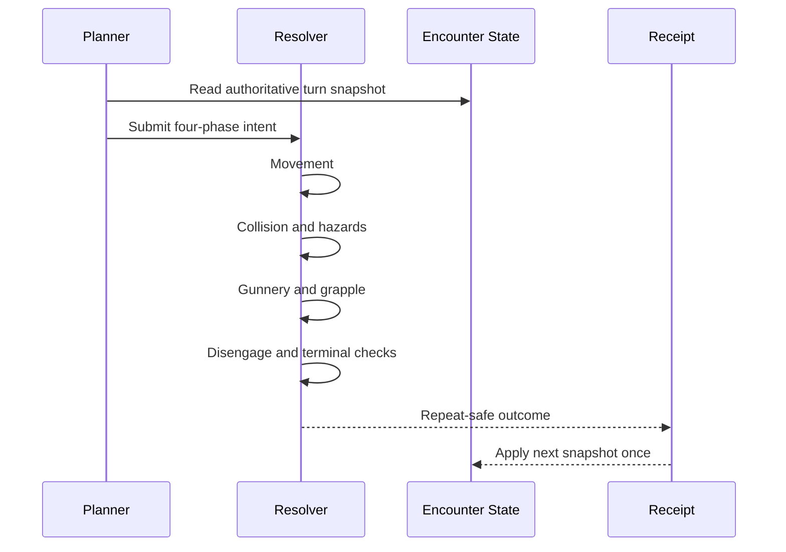

Naval combat has a large visual surface: ships, cannons, water, hazards, crew, and a tactical HUD. Starting with those visuals would have made the rules difficult to test and even harder to change.

I started CityRPG naval combat as a headless deterministic system. The same state and intent must produce the same plan, resolution, and receipt before a ship mesh enters the picture.

## A durable rule spine

The tactical board is a 24 by 24 grid with eight facings and four ordered phases per turn. Each phase can contain one movement choice and at most one side action.

Movement tokens are consumed oldest-first and expire after five turns. Gun tokens persist until fired. Bilge reduces movement generation without removing the ability to shoot. Movement, collision or hazards, and side actions resolve in a fixed order.

Those rules are represented as data and contracts rather than hidden inside presentation code.

## Determinism is a multiplayer feature

Deterministic resolution simplifies far more than unit testing. It allows the server to publish a compact authoritative result while clients reproduce the presentation. It makes bugs replayable from captured state. It also prevents animation timing or physics variance from deciding who took damage.

Identity is preserved through the entire flow: voyage, encounter, ship, turn snapshot, receipt, and carryover. Applying the same receipt twice must not double damage, rewards, or persistence effects.

## The planner and resolver have different jobs

The planner determines legal intent and resource use. The resolver applies ordered consequences. Keeping those responsibilities separate makes it possible to test invalid moves, expired tokens, blocked cells, broadside reach, grapple range, bilge penalties, collision, escape pressure, and terminal states independently.

It also provides a clean seam for AI. An NPC planner can produce the same intent contract as a player without gaining a separate rulebook.

## Telemetry became part of the contract

State replay and structured receipts were added before live presentation. When an encounter failed, the test harness could compare the input snapshot, planned phases, resolved events, and final state rather than interpreting a video.

Only after that spine was stable did I connect forced encounters, turn timers, HUD notifications, cannon effects, collision playback, and environmental hazards.

Building headless first did not delay the visible feature. It made the visible feature an adapter over rules I could trust.
