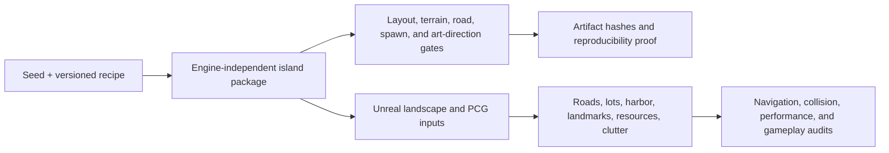

Procedural generation is easy to demonstrate and difficult to operate. A random seed can produce an attractive screenshot while still creating unreachable buildings, overlapping lots, broken roads, unsafe spawns, or an island that cannot be reproduced after a tool change.

I built the CityRPG island pipeline around a stronger contract: a known seed and recipe must generate the same source package, pass machine-readable validation, and remain usable by Unreal without allowing the editor to silently reinterpret the layout.

## Data before dressing

The generator first creates an engine-independent source package. It describes coastline, terrain, masks, roads, walls, gates, civic anchors, building lots, spawn points, harbor access, and gameplay connectivity.

Unreal consumes that package. It can materialize landscapes, splines, PCG inputs, buildings, shoreline dressing, landmarks, and clutter, but it does not invent or repair the authoritative gameplay layout during import.

## Reproducibility is a feature

The pipeline records hashes for heightmaps, masks, road graphs, districts, lots, anchors, walls, and previews. Reset and recovery contracts identify which generated assets are safe to replace. A generated-asset registry prevents a rebuild from deleting unrelated authored work.

A blank-map sandbox and regeneration plan prove that the island can be rebuilt from its source package rather than depending on undocumented editor residue.

## Seed 18422

One checked-in validation artifact demonstrates the contract. Seed `18422` produced:

- 36 non-overlapping building lots.
- 80 spawn points, including 64 marked safe.
- Five main roads and three wall gates.
- A harbor connected to the market and every required major point of interest.
- Verified lot clearance, terrain budgets, road alignment, and absence of catastrophic chokepoints.
- A hash for every required source artifact.

## From package to playable level

Later phases materialized wall gates, shoreline dressing, lot buildings, a playable graybox, harbor details, landmarks, district clutter, harvest nodes, and friendly or hostile NPC surfaces.

The pipeline then audited navigation, collision authority, harbor routes, player-visible cleanup, and performance. A promotion step moved a generated result into the playable-level path only after those gates passed.

This is the part of procedural generation I find most interesting. The generator is not finished when it produces content. It is finished when it can explain what it produced, reproduce it, validate it, recover it, and hand it safely to the runtime.
