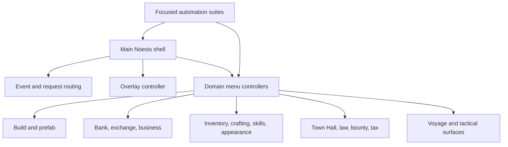

CityRPG's main Noesis implementation had become a 40,890-line C++ file with a 2,868-line header. It handled menus, shell behavior, event routing, build mode, inventory, crafting, voyages, civic systems, appearance, settings, notifications, and large parts of the test surface.

The problem was not merely file length. Every change had too many reasons to affect unrelated behavior.

## Refactor the contracts, not just the text

A mechanical file split would have moved lines without improving ownership. I first documented the compatibility contracts that could not change during migration:

- Existing Blueprint and Noesis bindings.
- Menu names and request payloads.
- Shell lifecycle and overlay behavior.
- Automation entry points.
- Server-authoritative request routing.
- Recovery behavior when a view or world dependency is unavailable.

The original class initially remained a facade while behavior moved behind it. Each sector had to preserve its public surface before the next sector started.

## Migrate by domain

The work moved through focused sectors: Town Hall, exchange, build-mode catalog state, appearance, shared request dispatch, UI event routing, deposits, laundering, law, bank heists, bounty boards, furnace, business, voyages, quests, crafting, inventory, skills, settings, and shell recovery.

The final structure spread responsibilities across 259 controller and shell source files and replaced the original implementation. The number is not a goal by itself; it reflects narrow translation units around coherent ownership and test seams.

## Split the tests too

The original automation file had the same coupling problem as the implementation. I separated build-mode, service, civic, voyage, appearance, crafting, inventory, and shared-support tests so a failure pointed toward a real domain.

This was essential to making the refactor safe. Compilation proved symbols moved correctly. Focused automation proved behavior and payload contracts still matched.

## Finish the rename

Compatibility names are useful during migration and harmful afterward. Once the old class was gone, remaining `Cheat` terminology was renamed to `Main` or `Debug` according to actual responsibility. That prevented a temporary migration shell from becoming permanent architecture.

Large refactors become manageable when each step has a boundary, a compatibility rule, and an executable proof. The achievement was not deleting 43,758 lines from two files. It was making future changes local again.
