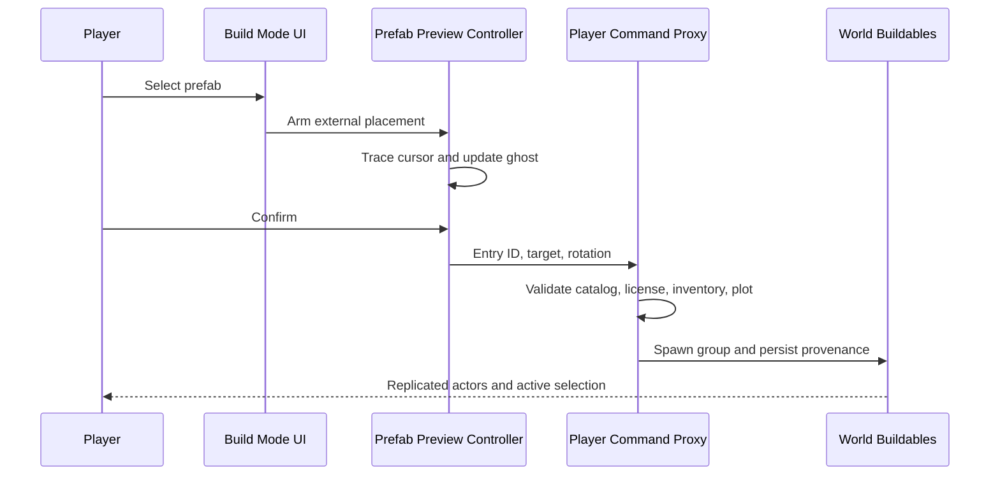

A placement preview should feel immediate. The decision to create a persistent multiplayer object cannot be trusted to the preview.

CityRPG's prefab flow separates those responsibilities while still behaving like one continuous build-mode interaction.

## One placement intent at a time

The game supports normal recipe placement and larger prefab groups. Allowing both tools to believe they own the next click creates duplicate placements and confusing cancellation behavior.

Selecting a prefab cancels the normal recipe preview, marks external placement active, spawns a lightweight ghost, captures the placement input, and returns the menu to quick slots. Selecting a normal recipe performs the reverse transition.

## Preview fast, validate twice

The client checks the target continuously so invalid placement is visible before the click. For a normal player, every preview child must remain within an owned plot. Admins use the same interaction but can bypass plot containment through an explicit server rule.

The server repeats the important checks using authoritative data:

- The catalog entry exists and is permitted.
- The player owns the required license or inventory item.
- The target is valid.
- Every saved child pivot remains inside the owned plot when required.
- Inventory is consumed only after validation succeeds.

Client validation improves experience. Server validation protects the world.

## Preserve provenance

A prefab is a group, not a bag of unrelated spawned actors. Placement stamps provenance, creates a runtime group, marks persistence dirty, and returns the spawned actors to the owning client.

The build manager immediately selects the new group and enables its move, rotate, and resize tools. That small handoff is important: a successful server round trip should not make the player hunt for the object they just placed.

## Test the coordination failures

Automation covers plot containment, admin bypass, selection handoff, catalog persistence, cancellation, quick-slot ordering, recovery, and disagreement between normal recipe placement and external prefab placement.

Most build-mode bugs live between systems rather than inside one algorithm. The solution was to make ownership transitions explicit and ensure that the fast client path and durable server path describe the same placement intent.
